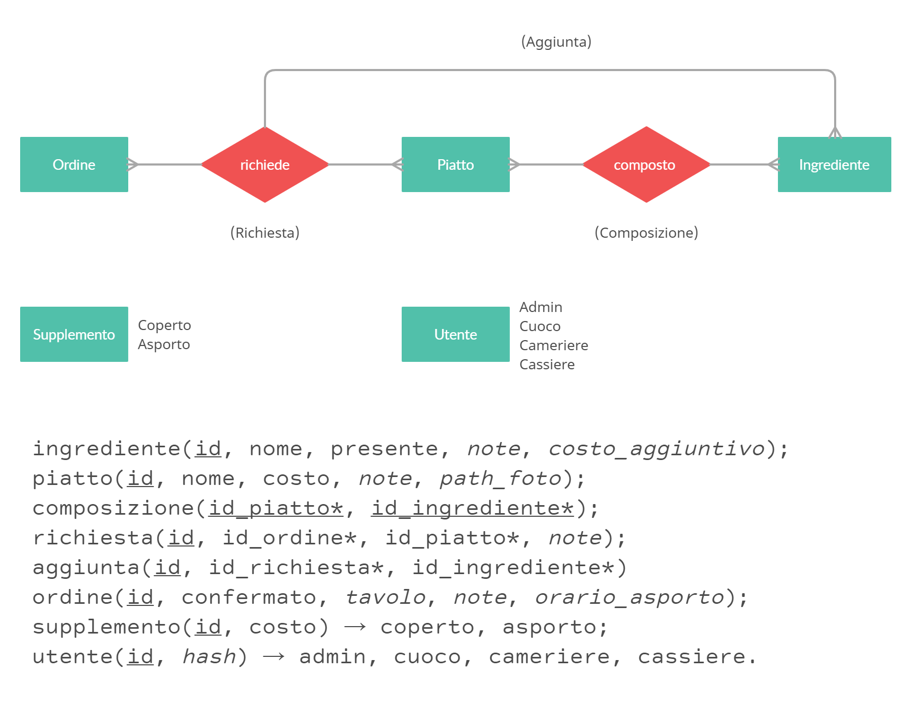

# Ristoware
Un software per ordinazione interna al ristorante e/o d'asporto.

# Il progetto
Ristoware si tratta di una suite di software in cooperazione per la gestione di ordinazioni.\
Le funzionalità principali che può offrire sono:
- gestione del menu;
- gestione delle ordinazioni;
- ordinazioni con pagamento online.

### Menu
Il menu è composto da piatti che sono a loro volta composti da ingredienti.
Gli ingredienti possono essere dichiarati come non disponibili.
Gli ingredienti non disponibili rendono impossibile da ordinare ogni piatto che li contiene.

### Ordinazioni
Le ordinazioni sono effettuabili, da parte di un cameriere tramite il software in dotazione,
o da parte dell'utente tramite il sito del ristorante (ordinazione online).
Le ordinazioni possono contenere più piatti.
I piatti ordinati possono contenere ingredienti aggiuntivi scelti dal cliente con,
se necessario, una nota.
Le ordinazioni locali terminate sono visualizzabili da parte del cassiere.

### Autorizzazioni

|    Grado    |                        Funzionalità                        |
|-------------|------------------------------------------------------------|
| `admin`     | Aggiunge nuovi piatti al menu                              |
| `cuoco`     | Dichiara gli ingredienti mancanti e accetta le ordinazioni |
| `cameriere` | Effettua ordinazioni locali                                |
| `cassiere`  | Visualizza le ordinazioni locali terminate                 |

## Implementazione

### Database
Per gestire tutti i dati necessari è opportuno l'utilizzo di un database.
Il database seguirà il seguente modello E/R e modello logico:

Il DBMS che verrà utilizzato è MariaDB sul quale dovrà essere eseguito il seguente script SQL:\
[ristoware.sql](./src/database/ristoware.sql)

Ogni ristorante utilizzatore di Ristoware ha una propria istanza di database.

### Server
Il linguaggio che si interfaccerà con il database per la manipolazione dei dati è PHP.
PHP dovrà inoltre gestire le autorizzazioni.

### Client
PHP coopererà anche con HTML/CSS/JS per la visualizzazione tramite interfaccia utente (UI).\
Ogni grado di autorizzazione ha una propria UI.
L'utente che intende effettuare un'ordinazione online potrà farlo su una UI web separata.
